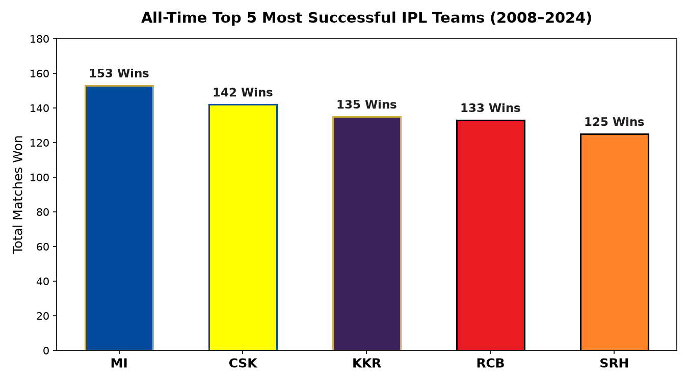
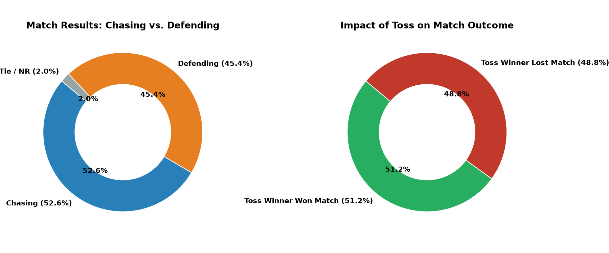
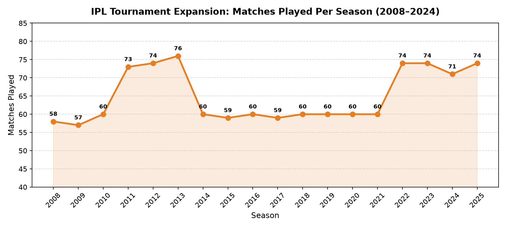

<div align="center">

# 🏏 IPL Data Analysis & Insights (2008 – 2024)

<p align="center">
  <b>A comprehensive data exploration of 1,169 matches across 16+ seasons of Indian Premier League history</b>
</p>

[](https://www.python.org/)
[](https://pandas.pydata.org/)
[](https://matplotlib.org/)
[](https://seaborn.pydata.org/)
[](https://github.com/jadavharsh109/IPL-Data-Analysis-Project)
[](https://www.linkedin.com/in/harshjadav0901/)
[](LICENSE)

</div>

---

### ⚡ Executive KPI Summary

| 🏆 Tournament Scope | ⚔️ Matches Analyzed | 🎯 Chasing Win Rate | 👑 Most Successful Team |
| :---: | :---: | :---: | :---: |
| **16+ Seasons (2008–2024)** | **1,169 Matches** | **52.6% (615 Wins)** | **Mumbai Indians (153 Wins)** |

---

## 📑 Table of Contents
- [📌 Business & Cricket Problem Statement](#-business--cricket-problem-statement)
- [📊 Key Analytical Insights & Storylines](#-key-analytical-insights--storylines)
  - [1. Franchise Hegemony: All-Time Match Win Leaders](#1-franchise-hegemony-all-time-match-win-leaders)
  - [2. Match Tactics: Chasing vs. Defending Breakdown](#2-match-tactics-chasing-vs-defending-breakdown)
  - [3. The Toss Myth: Is Winning the Toss Decisive?](#3-the-toss-myth-is-winning-the-toss-decisive)
  - [4. Tournament Evolution & Growth](#4-tournament-evolution--growth)
  - [5. Historic Blowouts: Largest Win Margins](#5-historic-blowouts-largest-win-margins)
- [📁 Project Structure](#-project-structure)
- [🗄️ Dataset Metadata](#️-dataset-metadata)
- [🐍 Sample Python Analysis Snippet](#-sample-python-analysis-snippet)
- [🚀 Quickstart & Setup Guide](#-quickstart--setup-guide)
- [👨‍💻 Author & Connect](#-author--connect)

---

## 📌 Business & Cricket Problem Statement

In dynamic franchise cricket, team management, analysts, and broadcasting teams constantly evaluate match conditions to inform in-game strategy. This analytical inquiry uncovers empirical answers to major cricketing questions:
1. **Franchise Consistency:** Which teams possess enduring structural advantages across player mega-auctions and leadership transitions?
2. **First-Innings vs. Second-Innings Advantage:** Does target chasing hold a persistent statistical edge across changing eras, rules (e.g. Impact Player), and dew conditions?
3. **The Coin Toss Factor:** How much does winning the toss actually increase a team's probability of winning the match?

---

## 📊 Key Analytical Insights & Storylines

### 1. Franchise Hegemony: All-Time Match Win Leaders

<p align="center">
  
</p>

| Rank | Franchise | Total Match Wins | Championship Pedigree |
| :---: | :--- | :---: | :--- |
| **1** | **Mumbai Indians (MI)** | **153** | 5-time IPL Champions |
| **2** | **Chennai Super Kings (CSK)** | **142** | 5-time IPL Champions (highest all-time win %) |
| **3** | **Kolkata Knight Riders (KKR)** | **135** | 3-time IPL Champions |
| **4** | **Royal Challengers Bangalore (RCB)** | **133** | 3-time Finalists |
| **5** | **Sunrisers Hyderabad (SRH)** | **125** | 2016 IPL Champions |

> 💡 **Key Takeaway:** Mumbai Indians and Chennai Super Kings form the foundational duopoly of IPL history, combining for **295 total wins and 10 titles**.

---

### 2. Match Tactics: Chasing vs. Defending Breakdown

<p align="center">
  
</p>

| Match Outcome Strategy | Wins Count | Win Share (%) | Tactical Implication |
| :--- | :---: | :---: | :--- |
| **Won by Chasing (Batting Second)** | **615** | **52.6%** | Preferred across night games due to evening dew |
| **Won by Defending (Batting First)** | **531** | **45.4%** | Critical in playoff pressure matches |
| **Tied / No Result** | 23 | 2.0% | Super Over or weather washouts |

> 💡 **Key Takeaway:** Chasing teams maintain a **7.2% overall advantage** (615 vs. 531). Ground dew, smaller modern boundary sizes, and precise run-rate calibration make batting second statistically superior in modern T20s.

---

### 3. The Toss Myth: Is Winning the Toss Decisive?

* **Toss Winner Won the Match:** **598 matches (51.15%)**
* **Toss Winner Lost the Match:** **571 matches (48.85%)**

> 💡 **Key Takeaway:** Winning the coin toss provides only a **1.15% advantage above pure chance**. While captains predominantly choose to bowl first to capitalize on the chasing bias, middle-overs execution and death bowling remain the true differentiators of victory.

---

### 4. Tournament Evolution & Growth

<p align="center">
  
</p>

> 💡 **Key Takeaway:** The tournament has scaled from **58 matches in the 2008 inaugural edition** to **74 matches per season**, reflecting the introduction of new franchises (Gujarat Titans, Lucknow Super Giants) and extended league windows.

---

### 5. Historic Blowouts: Largest Win Margins

| Season | Match | Winning Team | Margin | Match Highlight |
| :---: | :--- | :--- | :---: | :--- |
| **2017** | Delhi Capitals vs. Mumbai Indians | **Mumbai Indians** | **146 Runs** | MI scored 212/3; bowled DC out for 66 |
| **2016** | RCB vs. Gujarat Lions | **Royal Challengers Bangalore** | **144 Runs** | Twin centuries by Kohli (109) and De Villiers (129*) |
| **2008** | RCB vs. Kolkata Knight Riders | **Kolkata Knight Riders** | **140 Runs** | Brendon McCullum's iconic 158* on opening night |

---

## 📁 Project Structure

```text
IPL-Data-Analysis-Project/
├── assets/
│   ├── top_teams.png             # Visual chart: Top IPL franchises in official team colors
│   ├── toss_and_match_trends.png # Visual chart: Chasing vs defending & toss dynamics
│   └── season_growth.png         # Visual chart: Tournament matches growth trajectory
├── data/
│   ├── ipl_matches_data.csv      # Match records (2008–2024, 1,169 matches, 24 columns)
│   └── players-data-updated.csv  # Metadata for 772 IPL athletes
├── notebooks/
│   └── IPL_analysis.ipynb        # Cleaned, reproducible EDA notebook
├── .gitignore                    # Python & Jupyter cache exclusions
├── LICENSE                       # MIT License
├── requirements.txt              # Standardized environment dependencies
└── README.md                     # Documentation & visual showcases
```

---

## 🗄️ Dataset Metadata

A compact overview of the historical datasets:

| Dataset | Record Count | Attributes | Primary Key / Index | Core Fields |
| :--- | :---: | :---: | :---: | :--- |
| **`ipl_matches_data.csv`** | 1,169 | 24 | `match_id` | `season`, `venue`, `toss_winner`, `toss_decision`, `match_winner`, `win_by_runs`, `win_by_wickets` |
| **`players-data-updated.csv`** | 772 | 5 | `player_id` | `player_name`, `bat_style`, `bowl_style`, `nationality` |

---

## 🐍 Sample Python Analysis Snippet

```python
import pandas as pd
import numpy as np

# Load match records
matches = pd.read_csv("data/ipl_matches_data.csv")

# 1. Evaluate Toss Impact
toss_match_win = matches[matches["toss_winner"] == matches["match_winner"]]
toss_win_rate = (len(toss_match_win) / len(matches)) * 100
print(f"Toss Winner Win Rate: {toss_win_rate:.2f}%")

# 2. Chasing vs Defending Share
chasing_wins = (matches["win_by_wickets"] > 0).sum()
defending_wins = (matches["win_by_runs"] > 0).sum()
print(f"Chasing: {chasing_wins} | Defending: {defending_wins}")
```

---

## 🚀 Quickstart & Setup Guide

### 1. Clone Repository
```bash
git clone https://github.com/jadavharsh109/IPL-Data-Analysis-Project.git
cd IPL-Data-Analysis-Project
```

### 2. Install Requirements
```bash
pip install -r requirements.txt
```

### 3. Launch Notebook
```bash
jupyter notebook notebooks/IPL_analysis.ipynb
```

---

## 👨‍💻 Author & Connect

**Harsh Jadav**  
*Data Analyst | Data Scientist*  

[](https://www.linkedin.com/in/harshjadav0901/)
[](https://github.com/jadavharsh109)
[](mailto:jadavharsh109@gmail.com)
